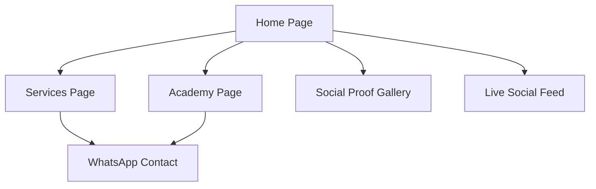

## 1. Product Overview
Esthetic For Live is a premium aesthetic medicine and beauty education website targeting the Colombian market. The platform showcases advanced facial and body treatments while establishing authority through professional training programs. It serves clients seeking high-end aesthetic services and professionals looking for specialized education in cosmetology.

The website positions Esthetic For Live as a trusted authority in aesthetic medicine, combining clinical expertise with luxury service delivery to attract discerning clients who value quality and professional results.

## 2. Core Features

### 2.1 User Roles
| Role | Registration Method | Core Permissions |
|------|---------------------|------------------|
| Website Visitor | No registration required | Browse services, view gallery, contact via WhatsApp |
| Potential Client | WhatsApp contact initiation | Schedule consultations, receive treatment information |
| Academy Student | Course enrollment process | Access training materials, certification programs |

### 2.2 Feature Module
The website consists of the following main pages:
1. **Home page**: Hero section with video background, services overview, social proof gallery, contact information.
2. **Services page**: Detailed treatment portfolio organized by categories (Facial Care, Body Contouring, Medical Aesthetics, Laser Technology).
3. **Academy page**: Professional training programs, course descriptions, certification information.

### 2.3 Page Details
| Page Name | Module Name | Feature description |
|-----------|-------------|---------------------|
| Home page | Hero section | Display cinematic video loop of facial treatment, showcase headline "Expertos en Armonización Facial y Corporal en Colombia", sub-headline about advanced treatments, primary CTA button "Agendar Valoración" linking to WhatsApp. |
| Home page | Services overview | Present categorized service grid with elegant icons for Facial Care, Body Contouring, Medical Aesthetics, and Laser Technology sections. |
| Home page | Social proof gallery | Implement Before/After photo slider specifically for nose modeling, body MELA, and acne treatments. |
| Home page | Live social feed | Embed TikTok (@esthetic.for.live) and Instagram (@estheticforlivee) content snippets. |
| Home page | Footer contact | Display Colombia location, pink social media icons (Instagram, Facebook, TikTok), sticky floating WhatsApp button with "¡Escríbenos!" text. |
| Services page | Facial Care section | List "Limpieza Facial Profunda" ($130,000 COP), "Tratamiento para Acné", "Nutrilips 💋" ($300,000 COP) with descriptions and pricing. |
| Services page | Body Contouring section | Showcase "Reducción y Moldeo", "M.E.L.A", "Bodyflex" with detailed treatment descriptions. |
| Services page | Medical Aesthetics section | Present "Rinomodelación", "Bótox", "Cauterización", "Plasma Capilar" with procedure explanations. |
| Services page | Laser Technology section | Feature "Depilación Láser" with technology benefits description. |
| Academy page | Training programs | Display "Capacitación y Cursos Profesionales" title, cosmetology degree courses, advanced technique training for beauty professionals. |
| Academy page | Authority building | Show diploma imagery with "Seguimos Formando Profesionales" text, student practice photos. |

## 3. Core Process
**Client Journey Flow**: Visitor arrives on homepage → Views hero section with treatment video → Explores services portfolio → Examines before/after transformations → Contacts via WhatsApp for consultation → Schedules appointment.

**Professional Student Flow**: Visitor accesses academy section → Reviews available courses → Contacts for enrollment information → Begins professional training program.

## 4. User Interface Design

### 4.1 Design Style
- **Primary color**: Deep black (#000000) for backgrounds
- **Secondary color**: Clean white (#FFFFFF) for content cards
- **Accent color**: Vibrant Hot Pink (#E91E63) for buttons and CTAs
- **Button style**: Rounded corners with hot pink background and white text
- **Font**: Modern sans-serif, primary text in white, headers in hot pink
- **Layout style**: Card-based design with generous white space
- **Icon style**: Elegant, minimalist line icons in hot pink

### 4.2 Page Design Overview
| Page Name | Module Name | UI Elements |
|-----------|-------------|-------------|
| Home page | Hero section | Full-width video background with dark overlay, centered white headline text, hot pink CTA button positioned prominently below headline. |
| Home page | Services overview | Grid layout with white cards on black background, hot pink category headers, elegant line icons for each service category. |
| Home page | Social proof gallery | Horizontal slider with white frame cards, navigation arrows in hot pink, before/after comparison images. |
| Services page | Treatment cards | White rectangular cards with subtle shadow, hot pink price tags, descriptive text in white on black background. |
| Academy page | Authority section | Diploma imagery with white border, "Seguimos Formando Profesionales" text in hot pink, student photos in professional layout. |

### 4.3 Responsiveness
Desktop-first design approach with mobile adaptation. Touch interaction optimization for WhatsApp contact buttons and social media links. Responsive grid layouts that stack vertically on mobile devices while maintaining the luxury aesthetic.

### 4.4 Visual Elements
- **Video background**: Cinematic slow-motion facial cleansing or laser treatment process
- **Iconography**: Medical-grade aesthetic symbols in hot pink
- **Photography**: High-quality before/after transformations showcasing treatment results
- **Typography**: Clean, professional fonts that convey medical authority and luxury positioning