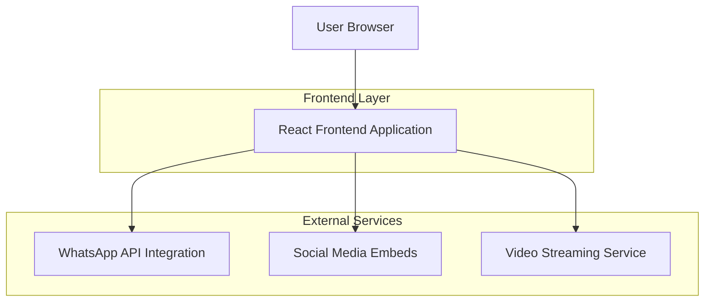
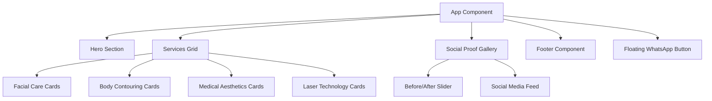

## 1. Architecture design


## 2. Technology Description
- Frontend: React@18 + tailwindcss@3 + vite
- Initialization Tool: vite-init
- Backend: None (Static deployment with external service integrations)

## 3. Route definitions
| Route | Purpose |
|-------|---------|
| / | Home page with hero section, services overview, social proof, and contact footer |
| /servicios | Services page displaying detailed treatment portfolio by categories |
| /academia | Academy page featuring professional training programs and courses |

## 4. API definitions
### 4.1 WhatsApp Integration API
```
https://wa.me/57300XXXXXXX?text=Hola,%20me%20gustaría%20agendar%20una%20valoración
```

Parameters:
- Phone number: Colombian WhatsApp business number
- Pre-filled text: "Hola, me gustaría agendar una valoración"

### 4.2 Social Media Embed APIs
TikTok Embed:
```
https://www.tiktok.com/embed/@esthetic.for.live
```

Instagram Embed:
```
https://www.instagram.com/estheticforlivee/embed
```

## 5. Component Architecture


## 6. Data Model
### 6.1 Services Data Structure
```javascript
const services = {
  facialCare: [
    {
      id: 'facial-1',
      name: 'Limpieza Facial Profunda',
      description: 'Renovación total de la piel. Elimina impurezas y células muertas para un rostro fresco.',
      price: '$130,000 COP',
      category: 'Rostros Radiantes'
    },
    {
      id: 'facial-2', 
      name: 'Tratamiento para Acné',
      description: 'Protocolos especializados para controlar brotes, reducir inflamación y mejorar la textura de la piel.',
      category: 'Rostros Radiantes'
    },
    {
      id: 'facial-3',
      name: 'Nutrilips 💋',
      description: 'Nutrición profunda, hidratación y revitalización del color natural de tus labios.',
      price: '$300,000 COP',
      category: 'Rostros Radiantes'
    }
  ],
  bodyContouring: [
    {
      id: 'body-1',
      name: 'Reducción y Moldeo',
      description: 'Terapias combinadas para reducción de medidas, moldeo de cintura y tratamiento efectivo contra la celulitis.',
      category: 'Cuerpo Soñado'
    },
    {
      id: 'body-2',
      name: 'M.E.L.A',
      description: 'Procedimiento avanzado para eliminar grasa localizada sin cirugía mayor. Resultados visibles y recuperación rápida.',
      category: 'Cuerpo Soñado'
    },
    {
      id: 'body-3',
      name: 'Bodyflex',
      description: 'Tecnología avanzada para tonificación y remodelación corporal.',
      category: 'Cuerpo Soñado'
    }
  ],
  medicalAesthetics: [
    {
      id: 'medical-1',
      name: 'Rinomodelación',
      description: 'Perfilamiento de nariz sin cirugía. Corrige imperfecciones y eleva la punta nasal al instante.',
      category: 'Alta Estética'
    },
    {
      id: 'medical-2',
      name: 'Bótox',
      description: 'Suaviza líneas de expresión y rejuvenece la mirada manteniendo tu naturalidad.',
      category: 'Alta Estética'
    },
    {
      id: 'medical-3',
      name: 'Cauterización',
      description: 'Eliminación segura y estética de verrugas y lunares (lunares/acrocordones).',
      category: 'Alta Estética'
    },
    {
      id: 'medical-4',
      name: 'Plasma Capilar',
      description: 'Bioestimulación para detener la caída del cabello y fortalecer el folículo.',
      category: 'Alta Estética'
    }
  ],
  laserTechnology: [
    {
      id: 'laser-1',
      name: 'Depilación Láser',
      description: 'Piel suave y libre de vellos con tecnología indolora y efectiva.',
      category: 'Laser Technology'
    }
  ]
}
```

### 6.2 Social Media Configuration
```javascript
const socialMedia = {
  tiktok: {
    username: '@esthetic.for.live',
    embedUrl: 'https://www.tiktok.com/embed/@esthetic.for.live'
  },
  instagram: {
    username: '@estheticforlivee',
    embedUrl: 'https://www.instagram.com/estheticforlivee/embed'
  },
  whatsapp: {
    phoneNumber: '+57300XXXXXXX',
    message: 'Hola, me gustaría agendar una valoración'
  }
}
```

## 7. Performance Optimization
- Lazy loading for video backgrounds and image galleries
- Optimized image formats (WebP) for before/after photos
- Code splitting for route-based components
- CDN integration for static assets
- Progressive Web App capabilities for offline functionality